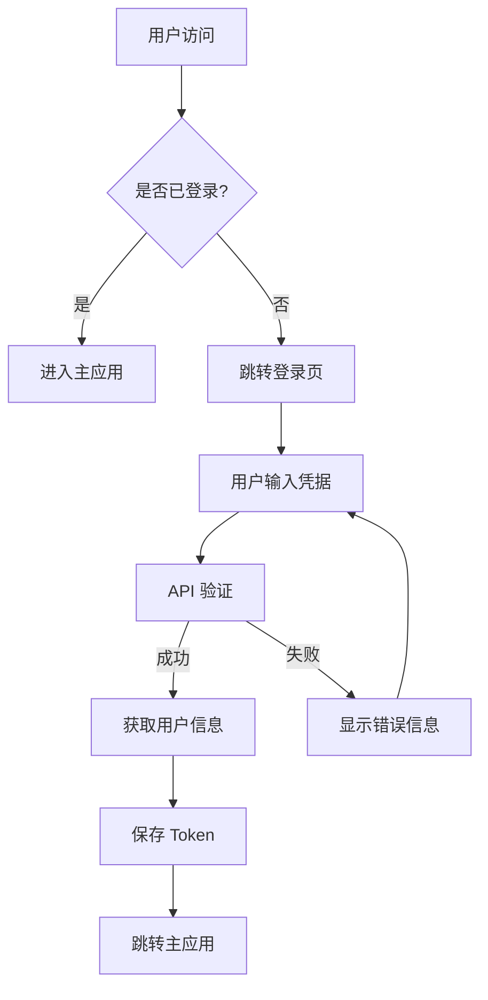

# Vue3 Admin 登录注册功能需求文档

> **功能目标**：为 Vue3 Admin 系统实现完整的用户认证功能，包括登录、注册、密码重置、会话管理等
>
> **技术栈**：Vue 3 + TypeScript + Pinia + Naive UI + gRPC/HTTP 双协议
>
> **设计理念**：现代化用户体验、安全性优先、响应式设计、无障碍访问

## 📋 功能概览

### 🎯 核心功能模块

| 功能模块 | 状态 | 优先级 | 复杂度 |
|---------|------|--------|--------|
| **用户登录** | 🔄 待实现 | P0 | ⭐⭐⭐ |
| **用户注册** | 🔄 待实现 | P0 | ⭐⭐⭐ |
| **密码重置** | 🔄 待实现 | P1 | ⭐⭐ |
| **会话管理** | 🔄 待实现 | P1 | ⭐⭐ |
| **权限验证** | 🔄 待实现 | P2 | ⭐⭐⭐ |
| **安全防护** | 🔄 待实现 | P2 | ⭐⭐⭐⭐ |

### 🔐 认证流程设计



---

## 🎨 页面设计规范

### 1. 登录页面 (`/login`)

#### 1.1 页面布局
```
┌─────────────────────────────────────┐
│                                     │
│           [Logo] 系统名称            │
│                                     │
│  ┌─────────────────────────────┐    │
│  │        登录表单              │    │
│  │  ┌─────────────────────┐    │    │
│  │  │ 手机号输入框         │    │    │
│  │  └─────────────────────┘    │    │
│  │  ┌─────────────────────┐    │    │
│  │  │ 密码输入框          │    │    │
│  │  └─────────────────────┘    │    │
│  │  ┌─────────────────────┐    │    │
│  │  │ 记住我 [ ]          │    │    │
│  │  └─────────────────────┘    │    │
│  │  ┌─────────────────────┐    │    │
│  │  │ [登录按钮]          │    │    │
│  │  └─────────────────────┘    │    │
│  │                             │    │
│  │  ┌─────────────────────┐    │    │
│  │  │ 忘记密码? 注册账号   │    │    │
│  │  └─────────────────────┘    │    │
│  └─────────────────────────────┘    │
│                                     │
└─────────────────────────────────────┘
```

#### 1.2 功能特性
- **表单验证**：实时验证手机号格式、密码强度
- **记住登录**：本地存储登录状态
- **错误处理**：友好的错误提示信息
- **加载状态**：登录按钮加载动画
- **协议切换**：开发模式下显示协议状态

#### 1.3 交互设计
```typescript
interface LoginForm {
  phone: string        // 手机号
  password: string     // 密码
  rememberMe: boolean  // 记住我
  captcha?: string     // 验证码（可选）
}
```

### 2. 注册页面 (`/register`)

#### 2.1 页面布局
```
┌─────────────────────────────────────┐
│                                     │
│           [Logo] 系统名称            │
│                                     │
│  ┌─────────────────────────────┐    │
│  │        注册表单              │    │
│  │  ┌─────────────────────┐    │    │
│  │  │ 用户名输入框         │    │    │
│  │  └─────────────────────┘    │    │
│  │  ┌─────────────────────┐    │    │
│  │  │ 手机号输入框         │    │    │
│  │  └─────────────────────┘    │    │
│  │  ┌─────────────────────┐    │    │
│  │  │ 验证码输入框        │    │    │
│  │  └─────────────────────┘    │    │
│  │  ┌─────────────────────┐    │    │
│  │  │ 密码输入框          │    │    │
│  │  └─────────────────────┘    │    │
│  │  ┌─────────────────────┐    │    │
│  │  │ 确认密码输入框      │    │    │
│  │  └─────────────────────┘    │    │
│  │  ┌─────────────────────┐    │    │
│  │  │ [注册按钮]          │    │    │
│  │  └─────────────────────┘    │    │
│  │                             │    │
│  │  ┌─────────────────────┐    │    │
│  │  │ 已有账号? 立即登录   │    │    │
│  │  └─────────────────────┘    │    │
│  └─────────────────────────────┘    │
│                                     │
└─────────────────────────────────────┘
```

#### 2.2 功能特性
- **分步验证**：用户名 → 手机号 → 验证码 → 密码
- **实时验证**：输入时实时检查格式和可用性
- **密码强度**：可视化密码强度指示器
- **验证码发送**：倒计时防重复发送
- **协议同意**：用户协议和隐私政策

#### 2.3 交互设计
```typescript
interface RegisterForm {
  username: string     // 用户名
  phone: string        // 手机号
  verificationCode: string // 验证码
  password: string     // 密码
  confirmPassword: string // 确认密码
  agreeToTerms: boolean // 同意协议
}
```

### 3. 密码重置页面 (`/forgot-password`)

#### 3.1 页面布局
```
┌─────────────────────────────────────┐
│                                     │
│           [Logo] 系统名称            │
│                                     │
│  ┌─────────────────────────────┐    │
│  │        密码重置              │    │
│  │  ┌─────────────────────┐    │    │
│  │  │ 手机号输入框         │    │    │
│  │  └─────────────────────┘    │    │
│  │  ┌─────────────────────┐    │    │
│  │  │ 验证码输入框        │    │    │
│  │  └─────────────────────┘    │    │
│  │  ┌─────────────────────┐    │    │
│  │  │ 新密码输入框        │    │    │
│  │  └─────────────────────┘    │    │
│  │  ┌─────────────────────┐    │    │
│  │  │ 确认密码输入框      │    │    │
│  │  └─────────────────────┘    │    │
│  │  ┌─────────────────────┐    │    │
│  │  │ [重置密码按钮]      │    │    │
│  │  └─────────────────────┘    │    │
│  │                             │    │
│  │  ┌─────────────────────┐    │    │
│  │  │ 返回登录            │    │    │
│  │  └─────────────────────┘    │    │
│  └─────────────────────────────┘    │
│                                     │
└─────────────────────────────────────┘
```

---

## 🔧 技术架构设计

### 1. 前端架构

#### 1.1 目录结构
```
src/
├── views/
│   ├── auth/
│   │   ├── Login.vue           # 登录页面
│   │   ├── Register.vue        # 注册页面
│   │   ├── ForgotPassword.vue  # 密码重置页面
│   │   └── components/         # 认证相关组件
│   │       ├── LoginForm.vue   # 登录表单组件
│   │       ├── RegisterForm.vue # 注册表单组件
│   │       └── AuthLayout.vue  # 认证页面布局
├── store/
│   ├── modules/
│   │   ├── user.ts             # 用户状态管理（已存在）
│   │   └── auth.ts             # 认证状态管理（新增）
├── request/
│   └── api/
│       ├── users.ts            # 用户API（已存在）
│       └── auth.ts             # 认证API（新增）
├── router/
│   ├── index.ts                # 主路由配置
│   └── modules/
│       └── auth.ts             # 认证路由模块
├── hooks/
│   ├── useAuth.ts              # 认证相关组合式函数
│   └── useFormValidation.ts    # 表单验证组合式函数
└── utils/
    ├── auth.ts                 # 认证工具函数
    └── validation.ts           # 验证工具函数
```

#### 1.2 状态管理设计

**认证状态管理** (`store/modules/auth.ts`)：
```typescript
interface AuthState {
  // 认证状态
  isAuthenticated: boolean
  isLoading: boolean
  error: string | null

  // 表单状态
  loginForm: LoginForm
  registerForm: RegisterForm
  forgotPasswordForm: ForgotPasswordForm

  // 验证码状态
  captchaCountdown: number
  canSendCaptcha: boolean

  // 安全状态
  failedAttempts: number
  isLocked: boolean
  lockUntil: Date | null
}

interface AuthActions {
  // 认证操作
  login: (credentials: LoginForm) => Promise<boolean>
  register: (userData: RegisterForm) => Promise<boolean>
  logout: () => Promise<void>
  resetPassword: (data: ForgotPasswordForm) => Promise<boolean>

  // 验证码操作
  sendVerificationCode: (phone: string) => Promise<boolean>
  verifyCode: (phone: string, code: string) => Promise<boolean>

  // 表单操作
  updateLoginForm: (data: Partial<LoginForm>) => void
  updateRegisterForm: (data: Partial<RegisterForm>) => void
  resetForms: () => void

  // 安全操作
  checkSecurityStatus: () => void
  unlockAccount: () => void
}
```

#### 1.3 路由配置

**认证路由模块** (`router/modules/auth.ts`)：
```typescript
export const authRoutes: CustomRouteRecord[] = [
  {
    path: '/login',
    name: 'Login',
    component: () => import('@/views/auth/Login.vue'),
    meta: {
      title: '用户登录',
      noAuth: true, // 无需认证
      layout: 'auth' // 使用认证布局
    }
  },
  {
    path: '/register',
    name: 'Register',
    component: () => import('@/views/auth/Register.vue'),
    meta: {
      title: '用户注册',
      noAuth: true,
      layout: 'auth'
    }
  },
  {
    path: '/forgot-password',
    name: 'ForgotPassword',
    component: () => import('@/views/auth/ForgotPassword.vue'),
    meta: {
      title: '密码重置',
      noAuth: true,
      layout: 'auth'
    }
  },
  {
    path: '/reset-password',
    name: 'ResetPassword',
    component: () => import('@/views/auth/ResetPassword.vue'),
    meta: {
      title: '重置密码',
      noAuth: true,
      layout: 'auth'
    }
  }
]
```

### 2. API 接口设计

#### 2.1 认证 API (`request/api/auth.ts`)

```typescript
// 登录接口
export async function login(credentials: LoginForm): Promise<UnifiedApiResponse<AuthResponse>> {
  return apiCall<AuthResponse>('POST /auth/login', credentials)
}

// 注册接口
export async function register(userData: RegisterForm): Promise<UnifiedApiResponse<AuthResponse>> {
  return apiCall<AuthResponse>('POST /auth/register', userData)
}

// 发送验证码
export async function sendVerificationCode(phone: string): Promise<UnifiedApiResponse<void>> {
  return apiCall<void>('POST /auth/send-verification-code', { phone })
}

// 验证验证码
export async function verifyCode(phone: string, code: string): Promise<UnifiedApiResponse<boolean>> {
  return apiCall<boolean>('POST /auth/verify-code', { phone, code })
}

// 密码重置
export async function resetPassword(data: ForgotPasswordForm): Promise<UnifiedApiResponse<void>> {
  return apiCall<void>('POST /auth/reset-password', data)
}

// 刷新 Token
export async function refreshToken(): Promise<UnifiedApiResponse<AuthResponse>> {
  return apiCall<AuthResponse>('POST /auth/refresh', {})
}

// 登出
export async function logout(): Promise<UnifiedApiResponse<void>> {
  return apiCall<void>('POST /auth/logout', {})
}
```

#### 2.2 请求/响应类型定义

```typescript
// 登录请求
interface LoginRequest {
  phone: string
  password: string
  rememberMe?: boolean
  deviceInfo?: {
    platform: string
    userAgent: string
    timestamp: number
  }
}

// 注册请求
interface RegisterRequest {
  username: string
  phone: string
  verificationCode: string
  password: string
  agreeToTerms: boolean
}

// 密码重置请求
interface ForgotPasswordRequest {
  phone: string
  verificationCode: string
  newPassword: string
}

// 认证响应
interface AuthResponse {
  user: User
  token: string
  expiresAt?: string
  refreshToken?: string
}

// 验证码响应
interface VerificationCodeResponse {
  success: boolean
  message: string
  countdown?: number
}
```

### 3. 后端 API 设计

#### 3.1 Protobuf 定义

**认证相关消息** (`protos/auth.proto`)：
```protobuf
syntax = "proto3";

package auth;

import "common.proto";

// 登录请求
message LoginRequest {
  string phone = 1;
  string password = 2;
  bool remember_me = 3;
  DeviceInfo device_info = 4;
}

// 注册请求
message RegisterRequest {
  string username = 1;
  string phone = 2;
  string verification_code = 3;
  string password = 4;
  bool agree_to_terms = 5;
}

// 密码重置请求
message ForgotPasswordRequest {
  string phone = 1;
  string verification_code = 2;
  string new_password = 3;
}

// 验证码请求
message SendVerificationCodeRequest {
  string phone = 1;
  string type = 2; // "register" | "reset"
}

// 验证码验证请求
message VerifyCodeRequest {
  string phone = 1;
  string code = 2;
}

// 认证响应
message AuthResponse {
  User user = 1;
  string token = 2;
  string expires_at = 3;
  string refresh_token = 4;
}

// 验证码响应
message VerificationCodeResponse {
  bool success = 1;
  string message = 2;
  int32 countdown = 3;
}

// 设备信息
message DeviceInfo {
  string platform = 1;
  string user_agent = 2;
  int64 timestamp = 3;
}

// 认证服务
service AuthService {
  // 用户登录
  rpc Login(LoginRequest) returns (AuthResponse);

  // 用户注册
  rpc Register(RegisterRequest) returns (AuthResponse);

  // 发送验证码
  rpc SendVerificationCode(SendVerificationCodeRequest) returns (VerificationCodeResponse);

  // 验证验证码
  rpc VerifyCode(VerifyCodeRequest) returns (VerificationCodeResponse);

  // 密码重置
  rpc ResetPassword(ForgotPasswordRequest) returns (AuthResponse);

  // 刷新 Token
  rpc RefreshToken(RefreshTokenRequest) returns (AuthResponse);

  // 用户登出
  rpc Logout(LogoutRequest) returns (LogoutResponse);
}
```

---

## 🎯 功能实现细节

### 1. 表单验证规则

#### 1.1 手机号验证
```typescript
const validatePhone = (phone: string): ValidationResult => {
  const phoneRegex = /^1[3-9]\d{9}$/

  if (!phone) {
    return { isValid: false, message: '请输入手机号' }
  }

  if (!phoneRegex.test(phone)) {
    return { isValid: false, message: '请输入正确的手机号格式' }
  }

  return { isValid: true, message: '' }
}
```

#### 1.2 密码强度验证
```typescript
const validatePassword = (password: string): ValidationResult => {
  const minLength = 8
  const maxLength = 20

  if (!password) {
    return { isValid: false, message: '请输入密码' }
  }

  if (password.length < minLength) {
    return { isValid: false, message: `密码长度不能少于${minLength}位` }
  }

  if (password.length > maxLength) {
    return { isValid: false, message: `密码长度不能超过${maxLength}位` }
  }

  // 检查复杂度
  const hasLower = /[a-z]/.test(password)
  const hasUpper = /[A-Z]/.test(password)
  const hasNumber = /\d/.test(password)
  const hasSpecial = /[!@#$%^&*(),.?":{}|<>]/.test(password)

  const complexity = [hasLower, hasUpper, hasNumber, hasSpecial].filter(Boolean).length

  if (complexity < 3) {
    return {
      isValid: false,
      message: '密码必须包含大写字母、小写字母、数字和特殊字符中的至少3种'
    }
  }

  return { isValid: true, message: '密码强度合格' }
}
```

#### 1.3 用户名验证
```typescript
const validateUsername = (username: string): ValidationResult => {
  const minLength = 2
  const maxLength = 20
  const usernameRegex = /^[a-zA-Z0-9\u4e00-\u9fa5_-]+$/

  if (!username) {
    return { isValid: false, message: '请输入用户名' }
  }

  if (username.length < minLength) {
    return { isValid: false, message: `用户名长度不能少于${minLength}位` }
  }

  if (username.length > maxLength) {
    return { isValid: false, message: `用户名长度不能超过${maxLength}位` }
  }

  if (!usernameRegex.test(username)) {
    return { isValid: false, message: '用户名只能包含字母、数字、中文、下划线和连字符' }
  }

  return { isValid: true, message: '' }
}
```

### 2. 安全防护机制

#### 2.1 登录失败限制
```typescript
interface SecurityConfig {
  maxFailedAttempts: number    // 最大失败次数：5次
  lockDuration: number         // 锁定时间：30分钟
  captchaThreshold: number     // 验证码阈值：3次
}

const securityConfig: SecurityConfig = {
  maxFailedAttempts: 5,
  lockDuration: 30 * 60 * 1000, // 30分钟
  captchaThreshold: 3
}
```

#### 2.2 验证码机制
```typescript
interface CaptchaConfig {
  codeLength: number           // 验证码长度：6位
  expireTime: number          // 过期时间：5分钟
  resendInterval: number      // 重发间隔：60秒
}

const captchaConfig: CaptchaConfig = {
  codeLength: 6,
  expireTime: 5 * 60 * 1000, // 5分钟
  resendInterval: 60 * 1000   // 60秒
}
```

#### 2.3 Token 管理
```typescript
interface TokenConfig {
  accessTokenExpire: number    // 访问令牌过期时间：2小时
  refreshTokenExpire: number   // 刷新令牌过期时间：7天
  autoRefreshThreshold: number // 自动刷新阈值：10分钟
}

const tokenConfig: TokenConfig = {
  accessTokenExpire: 2 * 60 * 60 * 1000, // 2小时
  refreshTokenExpire: 7 * 24 * 60 * 60 * 1000, // 7天
  autoRefreshThreshold: 10 * 60 * 1000 // 10分钟
}
```

### 3. 用户体验优化

#### 3.1 加载状态管理
```typescript
interface LoadingStates {
  isLoginLoading: boolean
  isRegisterLoading: boolean
  isCaptchaLoading: boolean
  isResetLoading: boolean
}

const loadingStates = reactive<LoadingStates>({
  isLoginLoading: false,
  isRegisterLoading: false,
  isCaptchaLoading: false,
  isResetLoading: false
})
```

#### 3.2 错误处理机制
```typescript
interface ErrorMessages {
  [key: string]: string
}

const errorMessages: ErrorMessages = {
  'INVALID_CREDENTIALS': '手机号或密码错误',
  'USER_NOT_FOUND': '用户不存在',
  'USER_DISABLED': '账户已被禁用',
  'INVALID_CAPTCHA': '验证码错误或已过期',
  'PHONE_ALREADY_EXISTS': '手机号已被注册',
  'USERNAME_ALREADY_EXISTS': '用户名已被使用',
  'TOO_MANY_ATTEMPTS': '登录失败次数过多，请稍后再试',
  'NETWORK_ERROR': '网络连接失败，请检查网络设置',
  'SERVER_ERROR': '服务器内部错误，请稍后重试'
}
```

#### 3.3 响应式设计
```css
/* 移动端适配 */
@media (max-width: 768px) {
  .auth-container {
    padding: 20px;
  }

  .auth-form {
    width: 100%;
    max-width: 400px;
  }

  .auth-logo {
    width: 80px;
    height: 80px;
  }
}

/* 平板适配 */
@media (min-width: 769px) and (max-width: 1024px) {
  .auth-container {
    padding: 40px;
  }

  .auth-form {
    width: 450px;
  }
}

/* 桌面端适配 */
@media (min-width: 1025px) {
  .auth-container {
    padding: 60px;
  }

  .auth-form {
    width: 500px;
  }
}
```

---

## 🧪 测试策略

### 1. 单元测试

#### 1.1 表单验证测试
```typescript
describe('表单验证', () => {
  test('手机号验证', () => {
    expect(validatePhone('13800138000')).toEqual({
      isValid: true,
      message: ''
    })

    expect(validatePhone('12345678901')).toEqual({
      isValid: false,
      message: '请输入正确的手机号格式'
    })
  })

  test('密码强度验证', () => {
    expect(validatePassword('Abc123!@#')).toEqual({
      isValid: true,
      message: '密码强度合格'
    })

    expect(validatePassword('123')).toEqual({
      isValid: false,
      message: '密码长度不能少于8位'
    })
  })
})
```

#### 1.2 API 调用测试
```typescript
describe('认证 API', () => {
  test('登录成功', async () => {
    const mockResponse = {
      user: { phone: '13800138000', username: 'test' },
      token: 'mock-token'
    }

    const result = await login({
      phone: '13800138000',
      password: 'password123'
    })

    expect(result[0]).toEqual(mockResponse)
    expect(result[1]).toBeNull()
  })

  test('登录失败', async () => {
    const result = await login({
      phone: '13800138000',
      password: 'wrong-password'
    })

    expect(result[0]).toBeNull()
    expect(result[1]).toBe('手机号或密码错误')
  })
})
```

### 2. 集成测试

#### 2.1 端到端测试
```typescript
describe('登录流程', () => {
  test('完整登录流程', async () => {
    // 1. 访问登录页面
    await page.goto('/login')

    // 2. 填写登录表单
    await page.fill('[data-testid="phone-input"]', '13800138000')
    await page.fill('[data-testid="password-input"]', 'password123')

    // 3. 点击登录按钮
    await page.click('[data-testid="login-button"]')

    // 4. 验证跳转到首页
    await expect(page).toHaveURL('/')

    // 5. 验证用户信息显示
    await expect(page.locator('[data-testid="user-name"]')).toHaveText('test')
  })
})
```

### 3. 安全测试

#### 3.1 暴力破解防护
```typescript
describe('安全防护', () => {
  test('登录失败限制', async () => {
    // 连续失败登录
    for (let i = 0; i < 5; i++) {
      await login({
        phone: '13800138000',
        password: 'wrong-password'
      })
    }

    // 验证账户被锁定
    const result = await login({
      phone: '13800138000',
      password: 'correct-password'
    })

    expect(result[1]).toBe('账户已被锁定，请30分钟后再试')
  })
})
```

---

## 📊 性能优化

### 1. 代码分割
```typescript
// 路由级别的代码分割
const Login = () => import('@/views/auth/Login.vue')
const Register = () => import('@/views/auth/Register.vue')
const ForgotPassword = () => import('@/views/auth/ForgotPassword.vue')
```

### 2. 缓存策略
```typescript
// 用户信息缓存
const userCache = new Map<string, User>()

// Token 缓存
const tokenCache = {
  accessToken: localStorage.getItem('access_token'),
  refreshToken: localStorage.getItem('refresh_token'),
  expiresAt: localStorage.getItem('token_expires_at')
}
```

### 3. 预加载优化
```typescript
// 预加载认证相关资源
const preloadAuthResources = () => {
  // 预加载认证页面
  import('@/views/auth/Login.vue')
  import('@/views/auth/Register.vue')

  // 预加载认证 API
  import('@/request/api/auth')
}
```

---

## 🚀 部署配置

### 1. 环境变量配置
```bash
# 认证相关配置
VITE_AUTH_API_URL=http://localhost:3030/auth
VITE_AUTH_GRPC_ENDPOINT=http://localhost:50051
VITE_AUTH_TOKEN_KEY=auth_token
VITE_AUTH_REFRESH_TOKEN_KEY=refresh_token

# 安全配置
VITE_MAX_LOGIN_ATTEMPTS=5
VITE_LOGIN_LOCK_DURATION=1800000
VITE_CAPTCHA_EXPIRE_TIME=300000

# 开发配置
VITE_AUTH_DEBUG=true
VITE_AUTH_MOCK_ENABLED=false
```

### 2. 构建优化
```typescript
// vite.config.ts
export default defineConfig({
  build: {
    rollupOptions: {
      output: {
        manualChunks: {
          auth: ['@/views/auth/Login.vue', '@/views/auth/Register.vue'],
          vendor: ['vue', 'vue-router', 'pinia']
        }
      }
    }
  }
})
```

---

## 📋 开发计划

### Phase 1: 基础认证功能 (Week 1-2)
- [ ] 创建认证页面组件
- [ ] 实现登录表单和验证
- [ ] 实现注册表单和验证
- [ ] 集成认证 API
- [ ] 配置路由守卫

### Phase 2: 安全增强 (Week 3)
- [ ] 实现验证码机制
- [ ] 添加登录失败限制
- [ ] 实现密码重置功能
- [ ] 添加 Token 自动刷新

### Phase 3: 用户体验优化 (Week 4)
- [ ] 响应式设计优化
- [ ] 加载状态和错误处理
- [ ] 无障碍访问支持
- [ ] 性能优化

### Phase 4: 测试和部署 (Week 5)
- [ ] 单元测试编写
- [ ] 集成测试
- [ ] 安全测试
- [ ] 生产环境部署

---

## 🎯 成功标准

### 功能完整性
- ✅ 用户能够成功注册新账户
- ✅ 用户能够使用手机号和密码登录
- ✅ 用户能够重置忘记的密码
- ✅ 登录状态能够正确保持和验证

### 安全性
- ✅ 密码强度验证通过
- ✅ 登录失败限制生效
- ✅ 验证码机制正常工作
- ✅ Token 安全存储和刷新

### 用户体验
- ✅ 表单验证实时反馈
- ✅ 错误信息清晰明确
- ✅ 加载状态友好提示
- ✅ 响应式设计适配各种设备

### 性能指标
- ✅ 页面加载时间 < 2秒
- ✅ API 响应时间 < 1秒
- ✅ 表单提交响应时间 < 500ms
- ✅ 内存使用量合理

---

**文档版本**：v1.0
**创建时间**：2024-01-XX
**最后更新**：2024-01-XX
**负责人**：开发团队
**审核状态**：待审核
