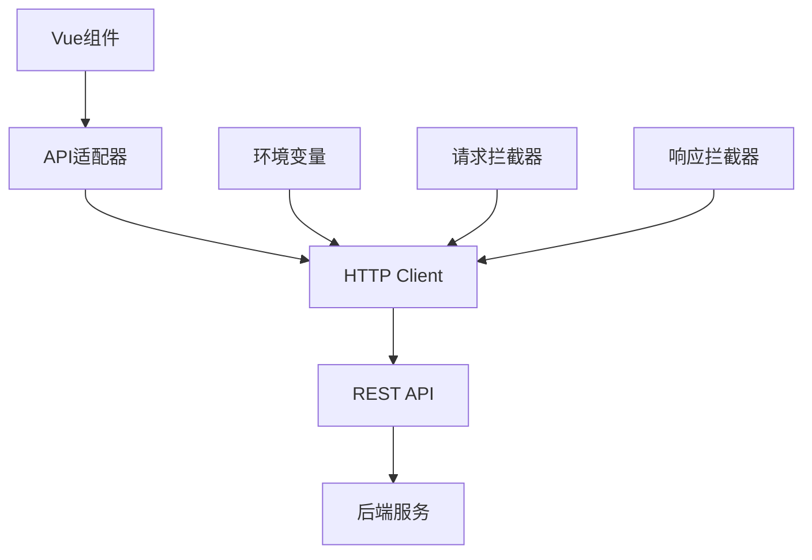

# Vue3 Admin - 现代化前端管理系统

> 基于 Vue 3 + TypeScript + Naive UI 的企业级管理后台

## 🚀 项目特色

- **现代化技术栈**：Vue 3 + Composition API + TypeScript + Vite 6
- **HTTP RESTful API**：标准化的 API 通信，简洁高效
- **优雅 UI 框架**：Naive UI 组件库，简洁美观
- **高性能 CSS**：UnoCSS 原子化 CSS，构建极速
- **类型安全**：TypeScript 类型定义，开发时类型检查
- **开发友好**：HMR 热更新，API 状态监控

## 📁 项目结构

```
apps/naive-admin/
├── src/
│   ├── components/          # 通用组件
│   │   ├── api-status/      # API协议状态组件
│   │   ├── dForm/           # 动态表单组件
│   │   └── ...
│   ├── layouts/             # 布局组件
│   ├── views/               # 页面组件
│   ├── store/               # Pinia状态管理
│   │   ├── modules/
│   │   │   ├── user.ts      # 用户状态
│   │   │   ├── permission.ts # 权限状态
│   │   │   └── global.ts    # 全局状态
│   ├── request/             # API层
│   │   ├── api-adapter.ts   # 统一API适配器
│   │   ├── api/             # 业务API
│   │   │   ├── users.ts     # 用户API
│   │   │   ├── rbac.ts      # 权限API
│   │   │   └── column.ts    # 专栏API
│   │   └── tests/           # API测试
│   ├── shared/              # 共享类型定义
│   ├── router/              # 路由配置
│   └── utils/               # 工具函数
├── vite-plugins/            # 自定义Vite插件
├── scripts/                 # 构建脚本
└── types/                   # TypeScript 类型定义
```

## 🏗️ 核心架构

### 1. HTTP API 通信架构



### 2. API 层设计

**统一调用接口**：

```typescript
// 统一的API调用方式
const [data, error] = await apiCall('GET /users', { page: 1 })
const [user, error] = await apiCall('POST /auth/login', { phone, password })

// 业务API封装
import { getCurrentUser, login } from '@/request/api/users'
const [user, error] = await getCurrentUser()
```

**HTTP 配置**：

```typescript
// 环境变量控制
VITE_API_URL=http://localhost:3000    # API 基础地址
VITE_API_TIMEOUT=10000               # 请求超时时间

// 请求配置
const apiConfig = {
  baseURL: import.meta.env.VITE_API_URL,
  timeout: 10000,
  headers: {
    'Content-Type': 'application/json'
  }
}
```

### 3. 状态管理

```typescript
// 用户状态
const userStore = useUserStore()
const { userInfo, isAuthenticated } = storeToRefs(userStore)

// 权限状态
const permissionStore = usePermissionStore()
const { permissions, hasAllPermissions } = storeToRefs(permissionStore)

// 全局状态
const globalStore = useGlobalStore()
const { loading, apiStats } = storeToRefs(globalStore)
```

## 🚦 快速开始

### 环境要求

- **Node.js**: ≥ 18.0.0
- **pnpm**: ≥ 8.0.0

### 安装依赖

```bash
# 在项目根目录安装
pnpm install

# 或在前端目录安装
cd apps/naive-admin
pnpm install
```

### 环境配置

创建环境变量文件：

```bash
# .env.development - 开发环境
VITE_API_URL=http://localhost:3000
VITE_API_TIMEOUT=10000
VITE_API_DEBUG=true

# .env.production - 生产环境
VITE_API_URL=https://api.yourdomain.com
VITE_API_TIMEOUT=30000
VITE_API_DEBUG=false
```

### 启动项目

```bash
# 启动开发服务器
pnpm run dev

# 或分步执行
pnpm run build     # 构建项目
pnpm run dev        # 启动开发服务器
```

访问：http://localhost:6767（如端口被占用会自动切换）

## 🛠️ 开发指南

### API 开发

1. **定义 Protobuf 消息**（位于根目录 `/protos`）：

```protobuf
// users.proto
message User {
  string phone = 1;
  string username = 2;
  bool isActive = 3;
  repeated string roleIds = 4;
}
```

2. **生成 TypeScript 类型**：

```bash
pnpm run proto:gen
```

3. **创建 API 函数**：

```typescript
// src/request/api/users.ts
export const getCurrentUser = async () => {
  return apiCall<User>('GET /auth/me', {})
}

export const updateUser = async (phone: string, data: Partial<User>) => {
  return apiCall<User>('PUT /users/{phone}', data)
}
```

### 组件开发

**权限组件示例**：

```vue
<template>
  <div v-if="hasPermission('user:create')">
    <n-button @click="handleCreate">创建用户</n-button>
  </div>
</template>

<script setup lang="ts">
import { useUserStore } from '@/store/modules/user'

const userStore = useUserStore()

const hasPermission = (permission: string) => {
  return userStore.hasPermission(permission)
}
</script>
```

**API 调用示例**：

```vue
<script setup lang="ts">
import { ref } from 'vue'
import { getCurrentUser } from '@/request/api/users'

const loading = ref(false)
const user = ref(null)

const fetchUser = async () => {
  loading.value = true
  const [data, error] = await getCurrentUser()

  if (error) {
    console.error('获取用户失败:', error)
    return
  }

  user.value = data
  loading.value = false
}
</script>
```

### 样式开发

**使用 UnoCSS 原子化类名**：

```vue
<template>
  <div class="flex-center p-4 bg-white rounded-lg shadow-md">
    <h1 class="text-xl font-semibold text-gray-800">标题</h1>
  </div>
</template>
```

**自定义快捷方式（已预配置）**：

- `flex-center` = `flex items-center justify-center`
- `flex-start` = `flex items-center justify-start`
- `shadow-rs` = `shadow-md`

## 🧪 测试

### 运行测试

```bash
# 运行所有测试
pnpm run test

# 运行API测试
pnpm run test:request

# 监听模式
pnpm run test:watch

# 测试覆盖率
pnpm run test:coverage
```

### 测试结构

```
src/request/tests/
├── unit/              # 单元测试
│   └── api-adapter.test.ts
├── integration/       # 集成测试
│   └── integration.test.ts
└── manual/           # 手动验证
    └── manual-test.ts
```

## 🚀 构建部署

### 构建项目

```bash
# 生产构建
pnpm run build

# 预览构建结果
pnpm run preview
```

### 部署配置

**Nginx 配置示例**：

```nginx
server {
  listen 80;
  server_name yourdomain.com;
  root /var/www/html;
  index index.html;

  # 前端路由
  location / {
    try_files $uri $uri/ /index.html;
  }

  # API代理
  location /api/ {
    proxy_pass http://backend:3000/;
  }

  # gRPC代理
  location /grpc/ {
    grpc_pass grpc://backend:3000;
  }
}
```

## 🔧 配置说明

### 环境变量

| 变量名           | 描述          | 默认值                  | 示例                      |
| ---------------- | ------------- | ----------------------- | ------------------------- |
| `VITE_API_URL`   | HTTP API 地址 | `http://localhost:3030` | `https://api.example.com` |
| `VITE_USE_GRPC`  | 是否启用 gRPC | `false`                 | `true/false`              |
| `VITE_API_DEBUG` | API 调试模式  | `false`                 | `true/false`              |

### 开发工具

**协议状态面板**（仅开发模式显示）：

- 📊 协议使用统计
- 🔄 一键协议切换
- 💚 API 健康状态
- ⚡ 性能监控

**访问方式**：开发模式下右上角自动显示

## 📚 技术栈详解

### 核心依赖

- **Vue 3.5+** - 渐进式 JavaScript 框架
- **TypeScript 5.8+** - JavaScript 的超集
- **Vite 6.3+** - 下一代前端构建工具
- **Naive UI 2.41+** - Vue 3 组件库
- **Pinia 2.3+** - Vue 状态管理库
- **UnoCSS 0.65+** - 即时原子化 CSS 引擎

### 通信层

- **Axios 1.7+** - HTTP 客户端
- **gRPC-Web 1.5+** - Web 端 gRPC 客户端
- **Protobuf 3.21+** - 数据序列化协议
- **ts-proto 2.7+** - TypeScript 代码生成器

### 开发工具

- **Vitest 4.0+** - 单元测试框架
- **Oxlint** - 快速 JavaScript/TypeScript 代码检查器
- **TypeScript Strict Mode** - 严格类型检查

## 💡 最佳实践

### 1. API 调用

```typescript
// ✅ 推荐：使用统一错误处理
const [users, error] = await getUsers()
if (error) {
  console.error('获取失败:', error)
  message.error(error)
  return
}

// ❌ 避免：直接抛出异常
try {
  const users = await getUsers()
} catch (error) {
  // 错误处理复杂
}
```

### 2. 状态管理

```typescript
// ✅ 推荐：响应式解构
const { userInfo, isAuthenticated } = storeToRefs(userStore)

// ❌ 避免：直接解构（丢失响应性）
const { userInfo, isAuthenticated } = userStore
```

### 3. 组件设计

```typescript
// ✅ 推荐：组合式API + TypeScript
interface Props {
  userId: string
  readonly?: boolean
}

const props = withDefaults(defineProps<Props>(), {
  readonly: false
})
```

### 4. 样式开发

```html
<!-- ✅ 推荐：原子化类名 -->
<div class="flex items-center space-x-4 p-6 bg-white rounded-lg">
  <!-- ❌ 避免：过度自定义CSS -->
  <div class="custom-complex-layout"></div>
</div>
```

## 🐛 故障排除

### 常见问题

1. **项目启动失败**

   ```bash
   # 清理依赖重新安装
   rm -rf node_modules pnpm-lock.yaml
   pnpm install
   ```

2. **Protobuf 类型错误**

   ```bash
   # 重新生成类型
   pnpm run proto:gen
   ```

3. **样式不生效**

   ```bash
   # 检查UnoCSS配置
   # 确保uno.config.ts正确配置
   ```

4. **API 调用失败**
   - 检查环境变量配置
   - 确认后端服务运行状态
   - 查看浏览器网络面板

### 性能优化

1. **启用 gRPC 协议**：生产环境建议启用 gRPC 获得更好性能
2. **组件懒加载**：大型组件使用动态导入
3. **图片优化**：使用现代图片格式（WebP）
4. **代码分割**：合理配置路由懒加载

## 🤝 贡献指南

### 提交规范

使用 [Conventional Commits](https://conventionalcommits.org/) 规范：

```bash
feat: 添加用户管理功能
fix: 修复登录状态异常
docs: 更新API文档
style: 优化组件样式
refactor: 重构权限检查逻辑
test: 添加用户API测试
```

### 开发流程

1. Fork 项目
2. 创建功能分支：`git checkout -b feature/amazing-feature`
3. 提交更改：`git commit -m 'feat: add amazing feature'`
4. 推送分支：`git push origin feature/amazing-feature`
5. 提交 Pull Request

## 📄 许可证

本项目采用 [MIT](LICENSE) 许可证。

## 🙏 致谢

感谢以下开源项目：

- [Vue.js](https://vuejs.org/) - 渐进式 JavaScript 框架
- [Naive UI](https://www.naiveui.com/) - Vue 3 组件库
- [UnoCSS](https://github.com/unocss/unocss) - 即时原子化 CSS 引擎
- [Vite](https://vitejs.dev/) - 下一代前端构建工具

---

**📧 联系方式**：如有问题请提交 [Issue](../../issues)

**🔗 相关项目**：

- [后端服务](../server/) - NestJS + gRPC 后端
- [共享配置](../configs/) - 通用构建配置
- [组件库](../packages/components/) - 可复用组件
